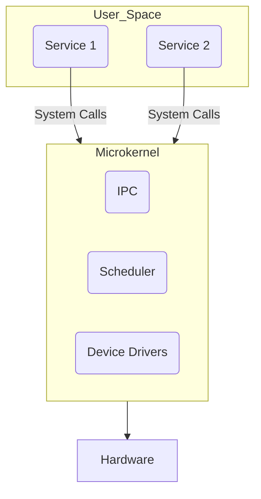

```mermaid
flowchart TB
    subgraph User_Space
        service1(Service 1)
        service2(Service 2)
    end
    
    subgraph Microkernel
        ipc(IPC)
        scheduler(Scheduler)
        drivers(Device Drivers)
    end
    
    Hardware[Hardware]

    service1 -- System Calls --> Microkernel
    service2 -- System Calls --> Microkernel
    Microkernel --> Hardware
```